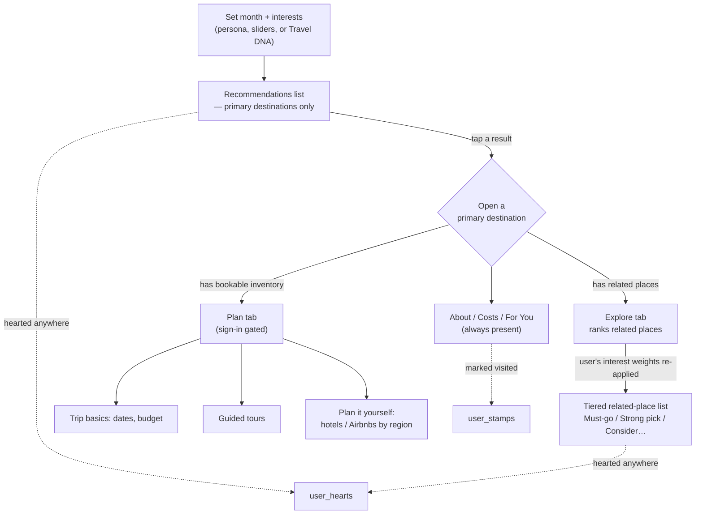
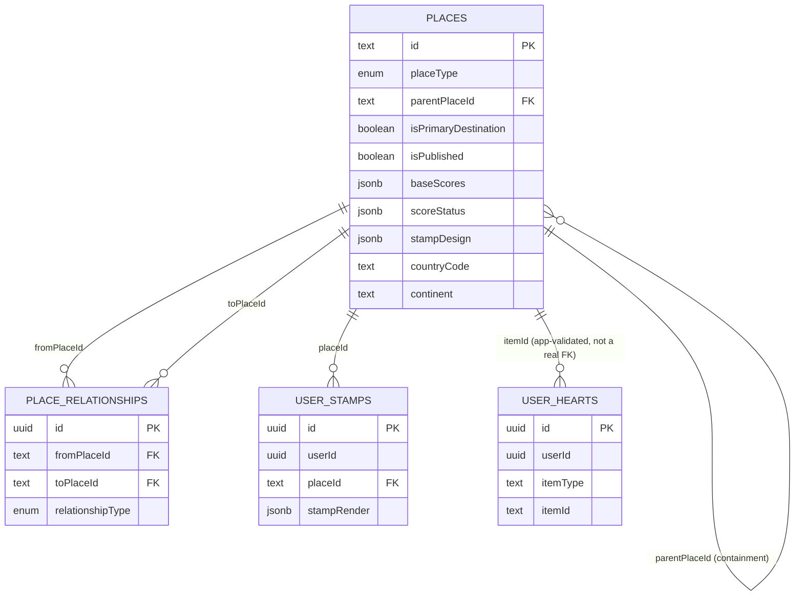
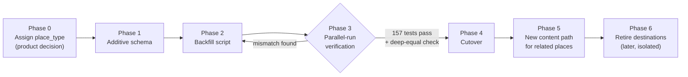

# Where To? — Final Architecture Plan

Source of truth for the Place hierarchy work: replacing the flat `destinations`
table with a generic `places` entity that supports primary destinations,
related (child) places, favorites, visited-tracking, and a clear path to
future hotels, activities, and trip planning — without breaking anything
about how the app ranks and displays today's 200 destinations.

This document consolidates three earlier discovery passes into one
implementation-ready reference: a full repository audit of the current
architecture, an evaluation of the Explore/Plan prototype screens (Claude
Design) and the product decisions embedded in them, and a concrete Supabase
schema/migration proposal refined against follow-up product questions
(results-list favoriting, the Stamps/map concept, and the passport-style
stamp visual system). Nothing described here has been implemented. No
Supabase migration has been run. No admin UI has been designed.

---

## Executive Summary

### The long-term vision

Where To? answers one question today — "Where should I go on vacation?" —
by ranking ~200 curated destinations against a user's interests and the
month they're traveling. That flow must stay exactly as simple as it is now.
On top of it, the product is adding a second question, asked only after a
destination is chosen: "Where within this destination should I go?" —
answered by ranking a destination's regions, cities, and parks (Cradle
Mountain, Freycinet, Bruny Island inside Tasmania) against the same
interests. Later layers — hotels, activities, visas, languages, flight
costs, itineraries — all attach to whichever place (primary or child) they
belong to, using the same identifier space from day one.

The single biggest architectural fact driving this whole plan: the scoring
engine, blurb generator, and badge logic in this codebase are **already**
written as pure functions over a generic destination-shaped object. None of
them know or care whether the thing they're scoring is called a
"destination." That's what makes a single generic `places` entity the right
foundation, rather than a second parallel table for child places.

### Key architectural decisions

1. **One generic `Place` entity** replaces the flat `Destination` concept.
   Every current destination becomes a `Place` with `isPrimaryDestination =
   true`; every future region/city/park becomes a `Place` with a parent.
2. **Product role is two orthogonal booleans**, not an enum:
   `isPrimaryDestination` (main-results eligibility) and `isPublished`
   (content readiness) are independent questions.
3. **Containment and association are two different mechanisms.**
   `parentPlaceId` is a strict, single-parent geographic tree. Everything
   else — day trips, gateway relationships, "commonly combined with" — is a
   separate many-to-many `place_relationships` table, because a single
   parent field cannot represent Champagne being both a primary destination
   and a Paris day trip at the same time.
4. **Score inheritance is a content-authoring decision, never a
   scoring-time behavior.** The scoring functions keep reading only
   whatever value is actually on the row they're given. This is what keeps
   the existing 200 destinations' scores provably unaffected by any of this
   work.
5. **Five value-states, not three.** Today's model only distinguishes a
   numeric value, "not applicable," and an import-time-forbidden missing
   state. Child places need explicit / inherited / calculated / missing /
   not-applicable, tracked without ever conflating "unresearched" with "we
   researched it and it's genuinely zero."
6. **Favorites are one generic, polymorphic mechanism** (`user_hearts`),
   not one table per heartable thing — because the same heart gesture
   already needs to work on primary destinations, related places, tours,
   and hotels.
7. **Visited-tracking (`user_stamps`) is built to allow one stamp per visit
   in the future**, without a breaking migration, by using a generated
   primary key instead of a one-row-per-place constraint — even though the
   MVP behavior is still "mark visited once."
8. **Promotion and demotion are column flips, not row moves.** A child
   place promoted to primary keeps its `id`, its relationships, and every
   future hotel/activity FK pointing at it — nothing has to be migrated
   between tables, because there was only ever one table.

---

## Product Model

### Place

The generic entity. Anything with a location, an identity, and (optionally)
interest scores: a country, a region, a state, an island, a city, a
neighborhood, a national park, a coastal area, a day trip. Every current
destination and every future sub-place is a `Place`. Structural identity
(what and where something is) is deliberately kept separate from product
role (is it primary, is it published) and from content completeness (does
it have full About/Costs copy) — a `Place` can be any combination of these
independently.

### Primary Destination

A `Place` with `isPrimaryDestination = true`. This is the only kind of
place that is:

- Eligible for the main "Where should I go?" ranking engine.
- Shown in the Recommendations list, and reachable via search.
- Expected to carry complete card content — About, Costs, Match score,
  Timing score.

The 200 (soon 400) destinations that exist today become primary
destinations, unchanged, on migration.

### Related Place

A non-primary `Place`, reached only by opening a primary destination's
Explore tab. Answers "where within this destination should I go?" Can carry
its own interest scores and its own seasonality, but does **not** get its
own About/Costs tabs — those stay properties of the parent destination.
Content bar is intentionally lower than a primary destination's: a score
per interest plus one short "why" line is enough to ship.

A related place reaches its parent one of two ways:

- **Contained by** it geographically (`parentPlaceId`) — Cradle Mountain is
  in Tasmania.
- **Related to** it without being contained by it (`place_relationships`)
  — Bruny Island is reached through Hobart; Versailles is a day trip from
  Paris without being "in" Paris.

### Explore

The in-destination tab that answers the second core question. Re-ranks a
primary destination's related places against the exact same interest
weights (persona, sliders, or Travel DNA) active at the top level — pinning
to "Hiking" inside Tasmania's Explore tab works the same way pinning to
"Hiking" does on the main Recommendations list. Results are grouped into
tiers (Must-go / Strong pick / Consider / If you have time / Skip), a pure
display-layer bucketing of the same underlying score, not a new stored
field. Explore is pure comparison and browsing — no bookable inventory
appears here.

### Plan

The logistics tab, gated behind sign-in ("Explore stays open to everyone"
is the explicit product line). Inside: trip basics (an interest snapshot,
flexible-vs-exact dates, a budget band), and two independently-toggleable
paths — guided tours/packages (no lodging decision) and plan-it-yourself
(hotel vs. Airbnb, region by region). This is where "exploring" (typical
pricing) becomes "planning" (real dates, real availability). Plan's
inventory is a fully separate, independently-scoped fetch from Explore's —
it should never load until a user actually opens Plan.

### Favorites / Wishlist

The heart icon — "Selection," in the product write-up's own vocabulary —
distinct from ambient Interest (the pill/slider weights) and from Saving
(the sign-in gate on Plan). Marks one specific item as wanted:
reversible, no account required, available on primary destinations,
related places, tours, and hotels alike. One generic mechanism
(`user_hearts`), not one table per content type.

### Future Hotels

Attach to exactly one place — a hotel has one physical location. Surfaced
only inside Plan, scoped to whichever related place(s) the user's trip
touches.

### Future Activities (tours/packages)

Attach to one *or more* places — the product's own tour cards already read
"Covers 1 of your top regions," implying a package spanning several related
places is expected. Needs a many-to-many join, not a single foreign key,
which is the one place hotels and activities genuinely differ in shape.

### How users move through the product

Hearting and stamping are always-available side actions, not steps in this
funnel — they can happen from the Recommendations list, from Explore, or
from Plan, and all resolve to the same underlying tables regardless of
where the gesture happened.

---

## Architecture Decisions

### Why Place was chosen

The scoring math (`deriveDestinationScores`, `scoreForMonth`,
`timingScoreForMonth`, `styleAdjustedScore`, `bandPenalty`), the blurb
generator, and the badge logic are all pure functions typed to accept any
object shaped like today's `ScoringDestination` — none of them read a
primary/child flag or assume anything about product role. Generalizing from
`destinationId` to `placeId` is a query-layer and naming concern, not a
scoring-math rewrite. On top of that, no other table in the codebase
references a destination by a real foreign key (`cards.sampleDestinations`
is free-text flavor, not a validated reference) — there is nothing to
rename or repoint elsewhere in the system. A single entity also means every
future feature (hotels, activities) needs exactly one kind of foreign key
(`placeId`) forever, instead of a `destinationId | subPlaceId` union.
Alternatives considered and rejected: a two-table split (`destinations` +
`sub_places`) would force an actual row move at promotion time, which the
product explicitly rules out; a fully polymorphic "everything is a node"
entity solves problems (hotels, activities) that are out of scope for this
phase and makes the one problem in scope harder to reason about for no
present benefit.

### Product-role strategy

`isPrimaryDestination` and `isPublished` as two independent booleans, not a
single role enum. They answer genuinely different questions — a place can
be primary-eligible but still being authored (unpublished), or a fully
published related place that's never primary. An enum would collapse two
axes into one and break the moment a third axis (e.g. "featured") shows up.
Don't build a general many-valued role-relationship table until a second
real use case for it exists beyond these two flags.

### Parent-child hierarchy

`parentPlaceId`: a nullable, self-referencing foreign key on `places`,
representing strict geographic containment only — one parent, forming a
tree (never a graph). Nothing at the database level prevents a cycle in a
plain self-FK; this needs an explicit guard (see Architecture Decisions →
score inheritance section's sibling note, and the Outstanding Product
Decisions list).

### Relationship model

`place_relationships`: a many-to-many join table for everything that isn't
containment — `nearby`, `day_trip`, `gateway_to`, `commonly_combined`,
`alternative_to`. Required, not optional, the moment day trips or
multi-primary places exist: Versailles is a day trip from Paris without
being contained by it; Champagne is simultaneously a primary destination
*and* a suggested Paris extension, which a single `parentPlaceId` field
could never express without duplicating the row. `place_relationships`
should never also carry a `contains` row — containment has exactly one
source of truth (`parentPlaceId`), never two.

### Handling compound destinations

21% of the current 200 destinations (42 of them) already have compound
names — "Cusco & Sacred Valley," "Tokyo & Kyoto," "Maasai Mara &
Amboseli," "Milford Sound & Fiordland." These are informal multi-place
bundles crammed into one row, one score, one blurb, today — the clearest
real-world evidence the flat model is already strained, and the natural
first candidates for decomposing into a primary place plus real related
places. No decomposition has been decided yet; **which destinations split,
and in what order, is an explicit open product decision** (see Outstanding
Product Decisions).

### Score inheritance strategy

Inheritance is something that happens once, at content-authoring time, and
is explicitly stamped — never a live fallback computed inside the scoring
engine. When a new related place is authored with no scores of its own yet,
an authoring tool *may* default its `base_scores` to a copy of its parent's,
but that copy must be marked `inherited` and traceable back to its source —
never presented as independently researched. The scoring functions
(`deriveDestinationScores`, `scoreForMonth`) keep reading only whatever
value is actually present on the row they're handed; they never walk up to
a parent at read time. This is also what protects the "existing scores
don't change" requirement — since none of the 200 current primary
destinations have a parent, none of them are eligible for inheritance at
all, so the mechanism structurally cannot touch them. A parent's score is
never calculated *from* its children's scores, either — a parent measures
the overall vacation opportunity; a child measures the specific place. Two
different questions, not a roll-up relationship.

### URL scheme

There are no per-destination URLs in the app today at all — everything
happens inline in one card in one flat list, which makes this decision
easier than it would be on an app already committed to a scheme. Whatever
routing gets introduced for opening a primary destination (or a related
place directly) should be **flat and keyed by the place's own stable `id`**
— `/places/hobart`, never `/places/tasmania/hobart`. Nesting under a parent
reads better for breadcrumbs, but breaks the instant a place is re-parented,
gains a second parent (Champagne), or is promoted from related to primary —
none of which should ever produce a broken link or a redirect. Flat URLs
survive all three with zero special-casing; parent context belongs in
in-page navigation, not the path.

### Deletion, archiving, and publishing

Three different concerns, not one:

- **Publishing** — `isPublished`, a plain visibility gate. Draft content
  not yet shown to anyone, even as a related place.
- **Archiving** — a soft-delete (e.g. a nullable `archivedAt`): the row,
  its scores, and every relationship stay fully intact, just excluded from
  normal queries. This should cover nearly every real "this place stopped
  mattering" case — a discontinued destination, a promotion reversed, a
  related place merged into another.
- **Hard deletion** — reserved for genuine data-entry mistakes only (a
  duplicate row, a place that should never have existed). Gated by the
  `ON DELETE RESTRICT` constraints on `parentPlaceId` and
  `place_relationships` above, which force a human to explicitly clear
  every reference before a row can be removed — never a silent cascade.

### Performance at scale

The single highest-risk existing pattern: `getAllScoredDestinations()`
fetches the entire table unconditionally and derives scores for every row
on every page load. That's fine — fast, invisible — at 200 or even 400
primary destinations, because the derivation is cheap arithmetic, not I/O.
It must **not** be reused unchanged once related places exist: fetching and
scoring thousands of related places on every load, when a given page only
ever needs the handful belonging to one open destination, would be real,
avoidable latency and a bloated client payload. Every related-place fetch
must be scoped (`WHERE parentPlaceId = :id`, triggered when a destination
is actually opened) — never folded into the initial page load, and never
pointed at "every place in the system" as one combined pool the way the
current primary-destination fetch is.

### Explicit vs. inherited vs. calculated vs. N/A vs. missing

Today's model has three states: a numeric value (0 is valid), "not
applicable" (`naSliders`, excluded from scoring entirely), and "missing" —
which the current import validator *forbids* from ever reaching the
database for a primary destination. That's the right bar for 200
hand-curated destinations; it cannot be the bar for potentially thousands
of related places authored incrementally. The model needs five states:

| State | Meaning | Representation |
|---|---|---|
| Explicit | Hand-researched for this exact place | `base_scores[key]` present, `score_status[key] = 'explicit'` |
| Inherited | Copied from a parent, not yet independently reviewed | `base_scores[key]` present, `score_status[key] = 'inherited'`, `score_inherited_from[key]` names the source place |
| Calculated | Derived by a formula, not authored directly | `score_status[key] = 'calculated'` (reserved; no current formula produces this without a base value except `deals`/`crowds`, which are a separate long-standing exemption) |
| Not applicable | Genuinely doesn't apply, in either direction | `naSliders` (unchanged from today) |
| Missing / unknown | Never addressed at all | Absence of a key in both `base_scores` and `score_status` — no placeholder value, no explicit tag |

These must never be conflated: a `0` is a real, researched judgment
("this place has this activity and it's genuinely bad"); missing is the
absence of a judgment; not-applicable is a structural fact about the place,
not a judgment about quality.

---

## Future Expansion Strategy

Each of these attaches to the existing `places` identifier space without a
structural redesign — the design goal of a single generic `Place` entity is
specifically to make this true.

**Hotels.** A future `stays` table, one row per property, a single
`placeId` foreign key. A hotel has exactly one physical location — the
simple case, and it works identically whether that location is a primary
destination or a related place.

**Activities / tours.** A future `tours` table plus a `tour_places` join
table (many-to-many) — a package can cover more than one related place
within a destination, which a single foreign key cannot express.

**Visas, languages.** Almost certainly new nullable columns directly on
`places` (`visaNote`, `primaryLanguage`, …) when they're built — one-to-one
facts about a place, not repeating records, so they don't need a new table
at all.

**Flight costs.** Most likely a live pricing lookup/integration at request
time, never a stored table. If caching ever becomes necessary, a
`flight_price_cache` keyed by `(originCode, placeId)` would be purely
additive.

**Itinerary planning.** The deferred "Trip Canvas" concept — a future
`trips` object holding a user's committed primary destination(s), selected
related places, selected tours/stays, and a day-by-day sequence. Safe to
defer entirely because every entity it would reference (`placeId`,
`user_hearts` rows, future `tours`/`stays`) already lives in one stable ID
space by the time `trips` gets built — nothing about building it later
requires touching what's built now.

---

## Recommended Data Model

Conceptual only — column-level detail, not a runnable migration.

### New tables (this phase)

**`places`** — supersedes `destinations`. Every existing column (month-fact
arrays, `sliderCaps`, `sliderEvents`, `costItems`, …) carries over exactly
as it is today; new columns: `placeType`, `parentPlaceId`,
`isPrimaryDestination`, `isPublished`, `summary` (the short "why" line
related places need instead of full About/Costs), `scoreStatus` +
`scoreInheritedFrom` (the five-state model above), `countryCode` (ISO
3166-1 **alpha-3** — matches the stamp badge display and common
map-boundary datasets, e.g. `"CRI"`), `continent`, `regionLabel` (a
postal/subdivision abbreviation — USPS 2-letter for US states, each
country's own convention otherwise), `latitude`/`longitude`, and
`stampDesign` (jsonb — the canonical shape/color/style for this place's
passport stamp, nullable, meant to have a deterministic algorithmic default
rather than requiring 200+ hand-curated designs before shipping). Prefer
deriving `continent` from `countryCode` via a small static code-level
lookup rather than hand-authoring it per row — it's a deterministic fact
about the country, not an editorial judgment call.

Two related notes worth carrying forward: today's `deriveDestinationScores`
already tolerates empty month-fact arrays gracefully — a slider with no
authored seasonality just falls back to its flat base value, no crash, no
special-casing needed. That's exactly the behavior related places with
partial content will rely on, and it requires no engine changes to work.
And once repeat stamps exist (see `user_stamps` below), **"places visited"
and "stamps collected" become two different numbers** —
`COUNT(DISTINCT placeId)` versus `COUNT(*)` — both legitimate, answering
different questions; worth not conflating them when that UI gets built.

**`place_relationships`** — `fromPlaceId`, `toPlaceId` (both FK →
`places.id`, `ON DELETE RESTRICT`), `relationshipType` (enum: `nearby` |
`day_trip` | `gateway_to` | `commonly_combined` | `alternative_to`),
optional `note`/`weight`. Unique on `(fromPlaceId, toPlaceId,
relationshipType)`; check `fromPlaceId <> toPlaceId`.

**`user_hearts`** — `userId`, `itemType` (`'place'` today; `'tour'` /
`'stay'` reserved), `itemId`. No real foreign key on `itemId` — it's
polymorphic across tables that don't all exist yet (`tours`/`stays`).
Validate `itemType = 'place'` rows against `places.id` in application code,
the same boundary-validation pattern already used for `naSliders` and
`cardSubdimensions` elsewhere in this schema. Unique on `(userId, itemType,
itemId)`.

**`user_stamps`** — replaces the earlier "`user_visited_places`" concept.
`id` is a generated primary key, **not** a composite `(userId, placeId)`
key, specifically so more than one stamp per place is structurally possible
later without a breaking migration — even though the MVP behavior only
ever inserts one row per user per place today. Columns: `userId`,
`placeId` (FK → `places.id`, `ON DELETE CASCADE`), `visitedAt`,
`stampRender` (jsonb — this specific stamp's rotation/opacity/smudge,
generated once at row creation and never regenerated on view). Indexed
(not unique) on `(userId, placeId)`.

### Constraints and indexes worth calling out now

- `places`: unique `slug`; check `parentPlaceId IS NULL OR parentPlaceId <>
  id`; index on `parentPlaceId` (children-of-X lookups); **partial** index
  on `isPrimaryDestination WHERE isPrimaryDestination` — this is what keeps
  the main ranking query fast once the table holds thousands of related
  places alongside a few hundred primary ones.
- `place_relationships`: indexes on both `fromPlaceId` and `toPlaceId` —
  both directions get queried ("what relates to Tasmania" and "what
  relates to Champagne").
- `user_hearts`: index on `userId`; index on `(itemType, itemId)` for
  future "how many people hearted this" aggregates.
- Nothing in this list requires a GIN index over the JSONB score columns
  yet — defer that until a real "search for an interest, show everywhere
  it's used" admin feature is actually being built; adding it later is
  cheap, adding it speculatively now is not free.
- Cycle prevention on `parentPlaceId` is an application-level ancestor-walk
  check on every parent-assignment write, not a database constraint — this
  matches how invariants are already enforced at the zod/import boundary
  elsewhere in this codebase rather than at the database layer.

### Entity relationships

### Unchanged existing tables

`domains`, `subdimensions`, `cards`, `dimensions`, `tensions`, `profiles`,
`userSwipes`, `userDnaState`, `userPreferences`, `userSavedProfiles`,
`travelDnaSnapshots` — no structural relationship to places today, no
action required by this work. `PERSONAS`, `SLIDERS`, `BAND_DIMENSIONS`
remain TypeScript code, not database rows, per the existing architectural
decision already documented in `schema.ts` — nothing here changes that.

### Deliberately excluded from this phase

`user_place_engagement` (an Interested → Committed funnel state) is
documented as a future concept but not specified as a table here — its
promotion trigger (manual tap vs. view count vs. dwell time) is explicitly
unresolved in the product write-up, and a table built ahead of that
decision would need reshaping the moment it's answered. `stays`, `tours`,
`tour_places` are reserved shapes only (see Future Expansion Strategy) —
no DDL until real inventory exists.

---

## Migration Strategy

Six phases. The live application is never at risk through cutover — every
phase up to and including Phase 4 is purely additive, and the existing 157
tests in `tests/scoring/*` are the gate between phases, not a wrap-up step
at the end.

### Phase 0 — Assign `place_type` to all 200 destinations

- **Goal:** every existing destination gets a real `placeType`
  (country/region/state_province/city/…) before migration.
- **Scope:** a one-time editorial pass, not automatable — today's `region`
  field is free-text prose ("Argentina & Chile"), so there's no way to
  derive place type from existing data.
- **Risks:** low technical risk, but a real product-judgment bottleneck —
  this gates every later phase and has no code fallback.
- **Validation:** every one of the 200 rows has a non-null `placeType`
  before Phase 2 begins.

### Phase 1 — Additive schema

- **Goal:** create `places`, `place_relationships`, `user_hearts`,
  `user_stamps` via a new Drizzle migration.
- **Scope:** schema only. `destinations` and every other existing table
  are untouched. Nothing in the live app reads from the new tables yet.
- **Risks:** effectively none — this is a schema-only change with no
  application code pointed at it.
- **Validation:** migration applies cleanly against a fresh database and
  against the existing seeded dev database; existing test suite
  unaffected (nothing changed that it exercises).

### Phase 2 — Backfill script

- **Goal:** copy all 200 `destinations` rows into `places` unchanged.
- **Scope:** a new `scripts/migrate-destinations-to-places.ts`, following
  the shape of the existing `migrate-legacy-data.ts`. Same `id`, same
  every value, `placeType` from Phase 0, `isPrimaryDestination = true`,
  `isPublished = true`, `parentPlaceId = null`, `scoreStatus` set to
  `'explicit'` for every key already present in `baseScores` (100% of them,
  today).
- **Risks:** a silent value-mapping bug (e.g. mis-ordering a month array)
  would be invisible without Phase 3's comparison — this phase should
  never be considered "done" without that gate passing.
- **Validation:** row count in `places WHERE isPrimaryDestination` equals
  200; spot-check a handful of destinations by hand.

### Phase 3 — Parallel-run verification (gate)

- **Goal:** prove the new read path produces byte-identical results to the
  old one before anything user-facing changes.
- **Scope:** build `getAllScoredPlaces()` *alongside* (not replacing)
  `getAllScoredDestinations()`, reading `places WHERE isPrimaryDestination`.
  Run the existing 157 tests against the new path. Add a deep-equal
  comparison script (same shape as `scripts/validate-content-migration.ts`)
  asserting every migrated place's derived scores match its original
  destination row's, for every slider, every month, exactly.
- **Risks:** this is the phase most likely to surface real bugs — treat
  any mismatch as a hard stop back to Phase 2, never a "close enough."
- **Validation:** all 157 existing tests pass unmodified; the deep-equal
  script reports zero mismatches across all 200 destinations × 28 sliders
  × 12 months.

### Phase 4 — Cutover

- **Goal:** make `places` the live read path.
- **Scope:** point the single call site (`src/app/page.tsx`) at
  `getAllScoredPlaces()`. Because the return shape (`ScoredDestination[]`)
  is unchanged, `ResultsApp`, `DestinationCard`, search, and `rank.ts`
  need zero edits.
- **Risks:** low, given Phase 3's gate — the main residual risk is
  something Phase 3's comparison didn't think to check. Keep `destinations`
  live and untouched as a same-day rollback path.
- **Validation:** manual smoke test of the live app against a handful of
  personas/months; the app is visually and numerically indistinguishable
  from before cutover.

### Phase 5 — New content path for related places

- **Goal:** enable authoring real related places (Cradle Mountain,
  Freycinet, …) for the first time.
- **Scope:** a second, more permissive zod schema and import script — only
  `id`, `name`, `parentPlaceId`, `placeType`, and `summary` required; every
  slider score, month array, and cost field optional.
- **Risks:** the permissive schema must not accidentally allow *primary*
  destinations to be authored incompletely — keep the two schemas
  genuinely separate, not one schema with conditionally-required fields
  that's easy to get wrong.
- **Validation:** author 3–5 real related places for one destination
  (Tasmania is the worked example throughout this plan) and confirm they
  render correctly in Explore before authoring at volume.

### Phase 6 — Retire `destinations` (later, isolated)

- **Goal:** remove the now-redundant legacy table.
- **Scope:** its own separately-verified commit, undertaken only once
  `places` has been the live read path for a stretch with no incidents.
- **Risks:** none if genuinely deferred — this phase has no deadline and
  nothing else in this plan depends on it happening soon.
- **Validation:** confirm no code path references `destinations` before
  dropping it; keep a database backup regardless.

Where the admin panel fits: nowhere in this list. It isn't a migration
step — it's what Phases 1–5 *unlock*. Once `places`, `place_relationships`,
and `user_hearts` are real, queryable Postgres tables, the
read/filter/sort/missing-data capabilities that motivate an admin tool
become buildable. Designing and building that interface remains its own,
separate piece of work — see `docs/admin-panel-plan.md` for the parts of
that effort (swipe cards, destinations, cost items, monthly slider scores,
and the audit-log/undo/concurrency safety net behind all of it) that are
independent of this migration and can proceed in parallel.

---

## MVP Recommendation

**Build now:**

- `places` — the 200 existing destinations, migrated in, plus room for
  related places.
- `place_relationships` — day trips, gateway relationships, everything
  non-containment.
- `user_hearts` — favorites, one generic polymorphic table, available on
  primary destinations *and* related places from day one.
- `user_stamps` — visited-tracking, shaped to allow repeat stamps later
  without a breaking migration, even though MVP behavior is single-stamp.

**Plan for later:**

- `tours`, `stays`, `tour_places` — reserved shapes documented above; no
  DDL until real inventory exists.
- `visaNote`, `currencyCode`, `primaryLanguage` and similar one-to-one
  place facts — likely new nullable columns on `places`, decided for real
  once they're actually in scope.
- `user_place_engagement` (Interested → Committed) — held back
  specifically because its promotion trigger is unresolved, not because
  it's low-value.
- The `trips` / Trip Canvas object — explicitly deferred in the product's
  own write-up.
- Retiring the `destinations` table (Phase 6) — no urgency once Phase 4
  has shipped cleanly.

**Avoid overbuilding:**

- A full polymorphic "content items" table unifying everything `user_hearts`
  might ever point at — two hypothetical future tables (`tours`, `stays`)
  don't justify that machinery yet; revisit once three or four real
  heartable tables exist.
- A database-level trigger or constraint preventing `parentPlaceId` cycles
  — an application-level ancestor-walk check is sufficient until more than
  one code path can edit places (i.e., until an admin tool exists).
- Hand-designing 200+ unique passport stamp visuals before shipping the
  Stamps feature — a deterministic algorithmic default (hashed from place
  id or country code) is sufficient to start; hand-authored `stampDesign`
  is an optional flourish, not a launch blocker.
- A `region_label`/subdivision-code backfill effort ahead of the map
  feature actually being built — worth prioritizing `countryCode` sooner
  (it's needed for continent grouping too), but the finer subdivision
  precision can wait until state-level map coloring is actually in scope.
- A real foreign key on `user_hearts.itemId` before `tours`/`stays` exist
  — application-level validation is the right amount of rigor for now.

---

## Repository Impact

Systems that will eventually be touched by this work, in rough order of
when they're affected:

- **`src/lib/db/schema.ts`** — four new table definitions (Phase 1).
- **`scripts/`** — two new scripts (`migrate-destinations-to-places.ts`,
  a related-places import script) plus a new deep-equal validation script,
  following the existing patterns in `migrate-legacy-data.ts` and
  `validate-content-migration.ts`.
- **`src/lib/db/queries/destinations.ts`** — a new `getAllScoredPlaces()`
  function added alongside the existing `getAllScoredDestinations()`
  (Phase 3), which later callers migrate to (Phase 4).
- **`src/app/page.tsx`** — one call-site change at cutover (Phase 4).
- **`src/lib/scoring/*`** — no logic changes at any phase. A type rename
  (`ScoringDestination` → a Place-shaped equivalent) is possible later, but
  only as its own isolated, separately-verified step, well after cutover.
- **`src/components/results/*`** — net-new UI, not a retrofit: there is no
  destination detail route or drill-down surface in the app today
  (everything happens inline in one card in one flat list). Explore, Plan,
  Stamps, hearting-on-results-rows, and any map view are all new
  components/screens, not modifications to existing ones.
- **`content/destinations/*.json`** — unchanged, remains the source
  content for primary destinations through at least Phase 5.
- **`tests/scoring/*`** — the regression gate for Phases 3–4; new tests
  needed for the `places`-backed query path and for `place_relationships`
  traversal once Explore is built.
- **`docs/`** — this document, plus an eventual `docs/content/adding-places.md`
  companion to the existing `docs/content/adding-destinations.md` once
  Phase 5 content authoring begins.
- **Not touched by this work at all:** the DNA/swipe engine (`src/lib/dna/*`,
  `cards`/`domains`/`dimensions`/`tensions` tables), `PERSONAS`/`SLIDERS`/
  `BAND_DIMENSIONS`, and Supabase Auth setup — none of these reference
  destinations by a real foreign key today, and none of this plan changes
  that.

---

## Migration Validation Checklist

To be run at the end of Phase 3, before Phase 4 cutover, and again as a
smoke test immediately after Phase 4 ships.

### Recommendation parity

- [ ] `places WHERE isPrimaryDestination` returns exactly 200 rows,
      matching `destinations` row-for-row on `id`.
- [ ] `computeRankedDestinations()` produces an identical ranking order,
      for every one of the four `PERSONAS`, for all 12 months, whether fed
      destinations from `getAllScoredDestinations()` or
      `getAllScoredPlaces()`.
- [ ] Search (`searchDestinations()`) returns identical results for a
      sample of at least 20 queries (exact name, partial name, region
      substring, alias match) against both data sources.
- [ ] Band-filter penalties (`bandPenalty()`) produce identical multipliers
      for every destination across all four band dimensions.

### Score parity

- [ ] For every one of the 200 destinations, every one of the 28 sliders,
      and all 12 months: `deriveDestinationScores()` output is byte-
      identical between the old and new data sources (the deep-equal
      script from Phase 3).
- [ ] N/A-slider exclusion (`isSliderNA`) behaves identically in both
      `scoreForMonth()` and `timingScoreForMonth()` against the migrated
      data.
- [ ] The `deals`/`crowds` no-base-value exemption still holds — neither
      slider is flagged as "missing" for any destination after migration.
- [ ] Badges (`computeBadges()`) are identical, month-by-month, for every
      destination.
- [ ] Monthly blurb text (`generateMonthlyBlurb()`) is byte-identical for
      every destination, every month.

### Travel DNA parity

- [ ] `convertTravelDNAToRecommendationWeights()` output is unchanged for
      a fixed set of recorded test swipe sequences (no code in this path
      is touched by the migration, but this confirms nothing in the
      `places` cutover indirectly affected it).
- [ ] `applyTravelDNAWeights()` end-to-end still produces the same
      `weights`/`earnedStyles`/`selectedStyles` for a known Travel DNA
      state before and after cutover.
- [ ] Swipe cards' `sampleDestinations` flavor text still renders
      correctly (confirms the loosely-coupled free-text field was
      unaffected, as expected).

### Monthly content parity

- [ ] `monthlyWeather` text (all 12 entries) is identical for every
      destination.
- [ ] `specialSeasons` entries are identical, including their `months`
      arrays and text.
- [ ] Cost items (`costItems`), cost range, and cost overview text are
      identical for every destination.
- [ ] Every month-fact array (`dry`, `wet`, `hot`, `cold`, `peak`, `low`,
      `wildlifePeak`, `wildlifeClosed`, `birdingPeak`, `hikingBest`,
      `hikingWorst`, `inaccessible`, `swimHazard`, `noSnow`) is identical,
      element-for-element, for every destination.

### Persona parity

- [ ] All four `PERSONAS` produce identical `weights` objects before and
      after (confirms `PERSONAS` — code, not data — was untouched, as
      expected by design).
- [ ] For each persona, the top-10 ranked destinations for a fixed test
      month are identical, in the same order, before and after cutover.
- [ ] `NEUTRAL_WEIGHT` and the top-5 "specialist boost" blend
      (`TOP_SCORE_BOOST_COUNT`/`TOP_SCORE_BOOST_WEIGHT`) produce identical
      scores — confirms no accidental change to `rank.ts` snuck in
      alongside the query-layer swap.

### General regression gate

- [ ] All 157 existing tests in `tests/scoring/*` pass, unmodified.
- [ ] `npx tsc --noEmit` is clean.
- [ ] A manual walkthrough of the live app — pick each of the four
      personas, pick a month, scroll the results, open a handful of cards,
      compare against a pre-migration screenshot or recording — shows no
      visible difference.

---

## Outstanding Product Decisions

Every unresolved question flagged across the three discovery passes this
document consolidates, in one place.

1. **Which compound-name destinations get decomposed into a primary place
   + real related places, and in what order?** No rule exists yet for the
   42 candidates identified. Without one, the rollout will read as
   arbitrarily inconsistent.
2. **Is the sheet-vs-full-page split for "opening a destination"
   intentional?** The prototypes show a bottom sheet for destinations with
   no related places, and a full navigated page for ones with Explore/Plan
   tabs. This might be exactly right, or might just be what got prototyped
   first.
3. **Should search ever surface a related place directly**, or only
   primary destinations, full stop? Not addressed by any prototype so far.
4. **Does a promoted place keep its old parent as a containment fact, or
   get cleared to standalone?** Both are defensible; the answer changes
   what a promoted place's breadcrumb/relationship UI shows.
5. **How many place types are actually needed at launch** versus
   speculative? The ten proposed (country, region, state_province, island,
   city, neighborhood, national_park, wilderness_area, coastal_area,
   day_trip) match what the prototypes evidence, but haven't been
   confirmed as the final near-term set.
6. **Does "Interested → Committed" ever apply below the primary-destination
   level**, or only at the top? Plan currently operates at the destination
   level, not per related place.
7. **Is Plan's "Trip basics" interest selection the same live state as the
   global ranking weights, or a forked, trip-scoped copy?** The prototype
   screenshots are consistent with either reading.
8. **Should a stamp remain strictly one-per-(user, place)**, or should
   visiting the same place twice ever produce a second stamp? Confirmed
   direction: build for the latter eventually, without committing to it as
   MVP behavior yet — the schema supports it either way.
9. **Should every stamp be hand-designed eventually**, or is the
   algorithmic default acceptable long-term? Confirmed for now: ship with
   the algorithmic default; revisit only if it doesn't look good enough in
   practice.
10. **What triggers automatic promotion from Interested to Committed** —
    a manual tap, a view-count threshold, a dwell-time signal, or some
    combination? Explicitly unresolved in the product write-up; this is
    exactly why `user_place_engagement` is held out of MVP scope.
11. **How a second top-level destination joins an existing trip** — a
    shared exploration board, or a persistent draft tray with a "Lock in"
    step? Two competing models remain live alternatives in the source
    product exploration, not yet converged.
12. **Should hearting a tour or stay work anonymously, like Explore does,
    or stay inside the email-gated Plan tab** the way it does in the
    current prototype?
13. **When does a first-class `trips` object (Trip Canvas) get built?**
    Agreed to be future work; no trigger condition defined yet.
